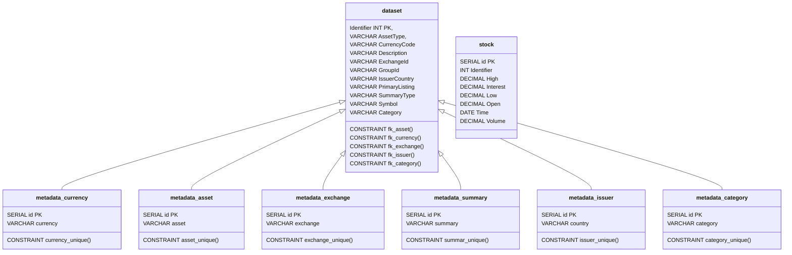

# How to set up Postgresql database

This folder contains the script to setup the database. This database will contain a databasse called `stonksdb` alongside different tables.

The following tables are related to historic data:

The following tables are related to models, forecasts and metrics:

A few things to note about the database:

- An index is created called `stock_id_index` to ensure fast lookup time on Identifier and Time on stocks.
- A user defined type `stock_type` is created when adding data to the database.
- IMPORTANT: When adding data to the database, use the function `upsert_stock`. This function will add the datapoint if it does not exists already (unique Identification and Time), and if it exists all values are updated.
  - Syntax fo `upsert_stock` = `SELECT upsert_stock (source:=(1,1.0,2.0,3.0,4.0,5.0,'01:01:2022 12:00:00',6.0))`
- IMPORTANT: When adding datasets to the database, use the function `upsert_dataset`. This function will add the datapoint if it does not exists already (unique Identification) and if it exists, update all values.

1. Install Postgres [here](https://www.enterprisedb.com/downloads/postgres-postgresql-downloads) and set it up.
2. Go to the bin folder of the postgres folder
3. Run the command `.\psql.exe -U postgres -a -f [PATH]\create-database.sql`
4. Insert usersecret `ConnectionString` in the `DatasetConstructor` project.
   - This is in the format: `Server=localhost;Port=5432;Database=stonksdb;User Id=[USERNAME];Password=[PASSWORD];Command Timeout=100`

<!-- 'docker run -d --name seq --restart unless-stopped -p 5341:80 -p 80:80 -v "C:\ProgramData\Seq\Data" -e ACCEPT_EULA=Y datalust/seq' -->
