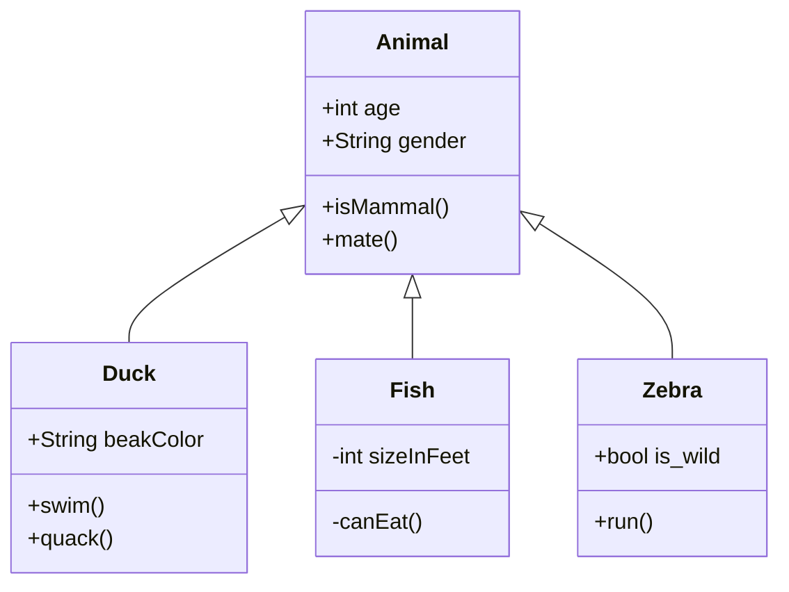

# How to set up Postgresql database

This folder contains the script to setup the database. This database will contain a databasse called `stonksdb` alongside different tables.

1. Install Postgres [here](https://www.enterprisedb.com/downloads/postgres-postgresql-downloads) and set it up.
2. 